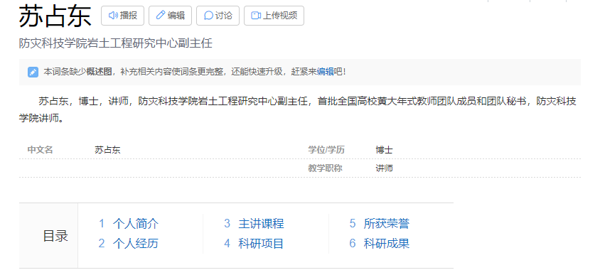

> 欢迎来到 **苏占东**的 **个人博客**页面！

>[!note]
>博客内容随时都有可能发生变动，博客并不保证实时更新，查看时请结合实际情况分析。此外，本博客**不保证**所引用的任何外部链接绝对安全可靠，各位访问时应注意保护个人隐私和计算机安全。

我的个人博客可能并不能解决所有关于你对我的问题(疑惑)，它更多的是介绍**我自己**的**成就**、**贡献**、**技巧**，以及一些**你常见的疑惑**。

你可以在本博客利用**侧边栏最上方的搜索框**试着搜索你的问题。

如果 博客 仍然不能解决你的问题，可以直接在钉钉联系我尝试寻求**我的帮助**。

[点击此处跳转到我的百度百科](https://baike.baidu.com/item/%E8%8B%8F%E5%8D%A0%E4%B8%9C/23422512?fr=aladdin)

