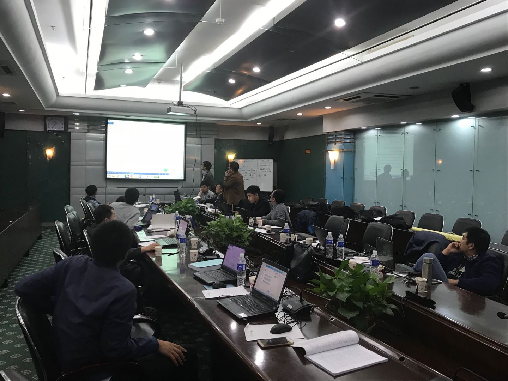

苏占东老师于2010.9 ~ 2015.6  在吉林大学的地质工程专业就读博士。

苏占东老师在我们这个行业已经潜心钻研了十几个日月，其专业知识的内涵以及其完成参与的项目很多都是国家的重点科研项目。

## 苏老师的学习经历

> 学习的意义绝对不是为了眼前的一些利益，而是为了为人民做出属于自己的贡献！

+ 2010.9—2015.6  吉林大学地质工程博士

+ 2006.9－2010.6  内蒙古大学土木工程学士
 > 苏老师建立实验室
>
 
## 苏老师的工作经历

+ 2019.3-2020.3德国地学研究中心（GFZGermanResearchCentreforGeosciences）访问学者

+ 2019.12-至今防灾科技学院地质工程学院副教授

+ 2015.9－2019.11防灾科技学院地质工程学院讲师

> 苏老师指导学生时的照片
>
 
 
 > 苏老师参加会议时的图片
>
 